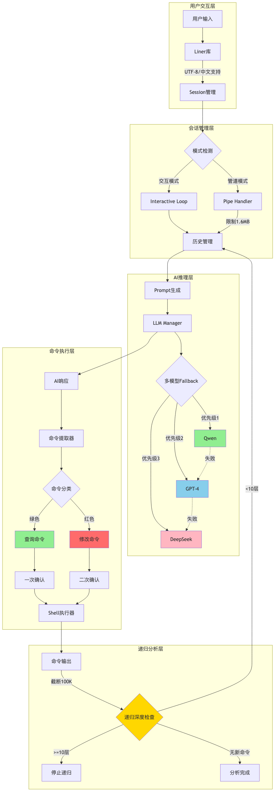
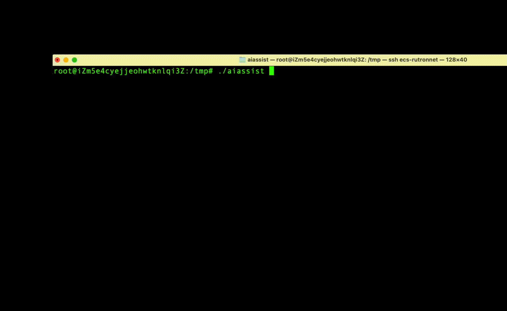
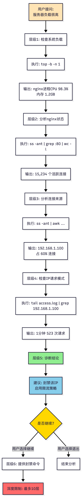
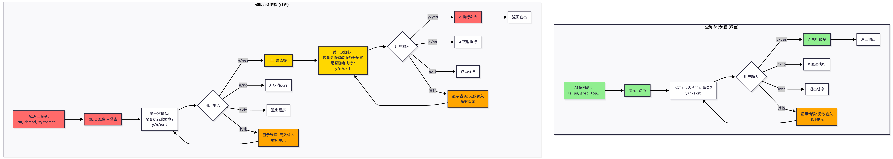
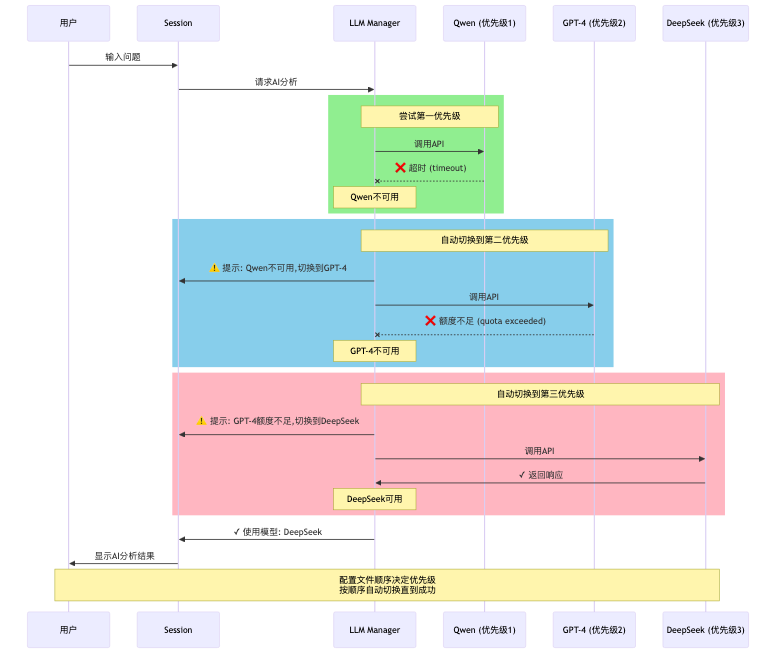

# AI Shell Assistant：让运维人员用自然语言"聊"服务器

> 🤖 一个完全由 AI 编写的开源运维工具，支持中文交互，多模型自动切换


## 写在前面

作为运维工程师，你是否遇到过这些场景：

- 凌晨3点被告警吵醒，脑子一片混乱不知道从哪里开始排查
- 面对陌生的系统，不知道该用什么命令诊断问题  
- 需要查手册、搜 StackOverflow，才能找到合适的诊断命令
- nginx 日志几万行，不知道如何快速定位异常

现在，你可以直接问 AI："**服务器负载很高，帮我排查原因**"

## 项目简介

**AI Shell Assistant (aiassist)** 是一个基于大语言模型的智能终端工具，通过自然语言交互为运维人员提供诊断分析、方案建议和命令执行指导。

**项目地址**: https://gitlab.cosmoplat.com/devops/aiassist  
**访问权限**: 联系 21001713 王伟阳 获取访问权限


*▲ 系统架构：从用户输入到命令执行的完整流程*

### 核心特点

✅ **自然语言交互** - 用人话提问，AI 给出专业诊断  
✅ **智能命令建议** - 自动分析并给出最合适的 Shell 命令  
✅ **连续对话分析** - 自动传递上一条命令的输出，支持最多10层递归诊断  
✅ **管道模式** - 直接分析日志输出，支持13,000行数据，自动生成分析报告  
✅ **多模型支持** - 支持所有 OpenAI 兼容接口，自动切换，显示当前可用状态  
✅ **安全可控** - 查询命令（绿色）和修改命令（红色警告）差异化展示，严格二次确认  
✅ **完美中文** - 支持中文输入、光标编辑、Ctrl+C退出

## 实现方式

### 技术架构

AI Shell Assistant 采用模块化架构设计，主要包含以下核心组件：

**1. 用户交互层 (Interactive)**
- **Bubble Tea UI**：提供现代化的终端交互界面，支持选择列表和文本输入
- **双模式设计**：
  - 交互式模式：支持连续对话和递归分析（最多10层）
  - 管道模式：非交互式，仅输出分析报告

**2. LLM 管理层 (LLM Manager)**
- **OpenAI 兼容接口**：统一的 API 调用层，支持所有兼容 OpenAI API 的模型
- **多模型配置**：Viper 配置管理，支持多个 Provider 和 Model
- **自动故障转移**：按优先级顺序调用，失败自动切换到下一个可用模型
- **模型状态检测**：启动时检测所有配置模型的可用性并显示

**3. 命令执行层 (Executor)**
- **命令分类识别**：通过正则表达式匹配识别查询命令和修改命令
  - 查询命令：`ps`, `top`, `df`, `ls`, `cat`, `grep` 等
  - 修改命令：`rm`, `kill`, `chmod`, `systemctl`, `reboot` 等
- **安全确认机制**：
  - 查询命令：单次确认（绿色提示，选择列表）
  - 修改命令：二次确认（红色警告，选择列表）
- **输出截断**：限制命令输出最大 400K 字符，防止内存溢出

**4. Prompt 工程**
- **系统提示词**：定义 AI 角色为 Linux 运维专家
- **上下文管理**：
  - 交互模式：累积历史对话，自动传递命令输出
  - 管道模式：专用分析 Prompt，输出结构化报告
- **多语言支持**：中英文双语 Prompt 和消息系统

**5. 内存保护机制**
- **递归深度限制**：最大 10 层，防止无限递归
- **输入大小限制**：管道输入最大 400K 字符（~1.6MB）
- **输出截断策略**：保留头尾关键信息，丢弃中间部分

### 工作流程

```
用户输入 → Prompt 构造 → LLM 调用 → 响应解析 → 命令提取 
    ↓                                              ↓
  管道数据 ←———— 命令执行 ←—— 安全确认 ←—— 命令分类
    ↓
递归分析（最多10层）
```

## 支持的功能

### 核心功能列表

**1. 自然语言交互**
- 支持中文和英文提问
- 理解运维场景的专业术语和问题描述
- 给出结构化的诊断步骤和建议

**2. 智能命令建议**
- 根据问题自动生成合适的 Shell 命令
- 命令带有详细说明和预期结果
- 支持复杂的命令组合（管道、重定向等）

**3. 连续对话分析（递归诊断）**
- 自动传递上一条命令的输出给 AI
- 基于输出结果进行下一步分析
- 支持最多 10 层递归深度
- 自动检测和警告递归深度超限

**4. 双模式运行**
- **交互模式**：连续对话，支持递归分析
- **管道模式**：一次性分析，输出结构化报告
- **单次问答**：快速获取诊断建议

**5. 多模型支持**
- 支持所有 OpenAI 兼容接口
- 启动时显示所有模型的可用状态
- 自动故障转移和负载均衡
- 支持的模型：Qwen、GPT-4、DeepSeek、Kimi、GLM 等

**6. 安全控制**
- 命令分类：查询命令 vs 修改命令
- 差异化确认：一次确认 vs 二次确认
- 颜色标识：绿色（安全）vs 红色（危险）
- 选择列表确认：使用上下箭头选择 Yes/No，Enter 确认

**7. 内存和性能保护**
- 管道输入限制：400K 字符（~13,000 行日志）
- 命令输出截断：400K 字符，保留头尾关键信息
- 递归深度限制：最大 10 层
- 防止内存耗尽和无限循环

**8. 国际化支持**
- 中英文双语界面
- 运行时切换语言
- 本地化的错误提示和帮助信息

## 实际使用场景

### 场景1：服务器资源排查


*▲ 真实场景演示：AI 一步步引导排查问题*

```bash
$ aiassist "当前服务器占用资源最多的服务是什么?"

[用户]: 当前服务器占用资源最多的服务是什么?

[bailian/qwen-max]:
你想要知道当前系统上占用资源最多的服务是什么。
要找出占用资源最多的服务，我们可以查看CPU和内存使用情况。

1. 获取所有进程的CPU和内存使用情况，并按CPU使用率排序
[cmd:query] ps -axww -o pid,%cpu,%mem,comm | sort -k2 -nr | head -n 10

查询命令:
ps -axww -o pid,%cpu,%mem,comm | sort -k2 -nr | head -n 10

是否执行此命令?
> Yes
  No

[执行输出]:
  161  19.7  0.6 /System/Library/.../WindowServer
16267  15.9  1.4 /Applications/Google Chrome.app/.../Renderer
  591  13.0  0.7 /Applications/Google Chrome.app/.../Helper
  516   3.9  0.9 /System/Applications/Utilities/Terminal.app/...

✓ 执行成功

[bailian/qwen-max]:
占用资源最多的服务是WindowServer，其PID为161，CPU使用率为19.7%。
其次是Google Chrome相关的进程。

✓ 所有分析已完成

请输入问题: 如何关闭这个服务?

[用户]: 如何关闭这个服务?

[bailian/qwen-max]:
WindowServer是macOS中负责图形界面的核心服务，直接关闭它会导致
系统失去图形界面显示能力。如果你想暂时释放资源，可以尝试强制退出。

1. 强制退出WindowServer
[cmd:modify] sudo kill -9 161

!!! 修改命令 (需要确认):
sudo kill -9 161

是否执行此命令?
> Yes
  No

!!! 警告: 该命令将修改服务器配置，是否确定执行?
  Yes
> No
```

### 场景2：管道模式分析日志


*▲ 管道模式：直接分析日志输出，支持13,000行数据*

```bash
# 分析系统日志
$ tail -n300 /var/log/messages | aiassist "分析下当前服务器有没有异常"

[bailian/qwen-max]:
### 总结输出
从提供的日志来看，系统存在多个问题，主要集中在以下几个方面：

1. **Kafka 集群节点连接问题**:
   - 节点 2 (IP: 10.203.55.14:9093) 和节点 3 (IP: 10.203.55.15:9093) 多次断开连接
   - Kafka RaftManager 经常进行选举超时和重新选举

2. **etcd 健康检查失败**:
   - etcd 无法连接到 peer `ac493644f6efb04e` (IP: 10.203.55.15:2380)
   - 多次出现 "no route to host" 错误
   - 多个读取请求执行时间过长，导致性能问题

3. **Java 应用程序错误**:
   - Java 应用程序在执行某些任务时遇到网络连接问题
   - 包括 UnknownHostException、NoRouteToHostException 和 ConnectException

### 可操作见解/指导

#### 1. 检查网络连接
检查节点 2 和节点 3 的网络连通性:
  ping 10.203.55.14
  ping 10.203.55.15

检查端口 9093 和 2380 是否开放:
  telnet 10.203.55.14 9093
  telnet 10.203.55.15 2380

#### 2. 检查服务配置
检查 Kafka 和 etcd 配置文件中的地址配置:
  cat /path/to/kafka/config/server.properties | grep listeners
  cat /path/to/etcd/config/etcd.conf | grep peer

#### 3. 检查 DNS 和防火墙
检查 DNS 解析和 /etc/hosts 文件:
  nslookup 10.203.55.14
  cat /etc/hosts

检查防火墙规则:
  sudo iptables -L

### 注释
管道模式仅进行分析建议不支持交互式操作。
✓ 所有分析已完成
```

### 场景3：交互式问题诊断

```bash
$ aiassist

-----------------------------------
欢迎使用 AI Shell Assistant
提示: 随时按 Ctrl+C 退出
-----------------------------------

[当前模型]
- bailian/qwen-max (默认)
- bailian/qwen-plus

请输入问题: 为啥服务器负载偶尔很高

[用户]: 为啥服务器负载偶尔很高

[bailian/qwen-max]:
你提到服务器负载偶尔很高，这可能是由于某个服务或进程在特定时间点
消耗了大量资源导致的。

1. 查看当前系统负载情况，确认是否处于高负载状态
[cmd:query] uptime

2. 检查CPU使用率最高的前几个进程，找出可能引起高负载的原因
[cmd:query] ps -eo pid,%cpu,%mem,comm --sort=-%cpu | head -n 10

3. 如果问题持续存在，请进一步查看系统日志以寻找异常信息
[cmd:query] journalctl -xe

查询命令:
uptime

是否执行此命令?
> Yes
  No

[执行输出]:
 13:12:59 up 237 days, 22:48,  2 users,  load average: 2.19, 1.72, 1.86
✓ 执行成功

[bailian/qwen-max]:
当前系统平均负载较高。继续检查CPU使用率最高的前几个进程。

[cmd:query] ps -eo pid,%cpu,%mem,comm --sort=-%cpu | head -n 10

查询命令:
ps -eo pid,%cpu,%mem,comm --sort=-%cpu | head -n 10

是否执行此命令?
> Yes
  No

[执行输出]:
  PID %CPU %MEM COMMAND
30440 45.9  4.8 pilot-discovery
14632  7.6  0.1 process-exporte
41147  7.2  3.0 kube-apiserver
33519  6.4  0.8 kubelet
✓ 执行成功

[bailian/qwen-max]:
pilot-discovery进程消耗了大量CPU资源(45.9%)，可能是导致服务器
负载高的原因。建议进一步检查该进程的详细信息和相关日志。

1. 查看pilot-discovery进程的详细信息
[cmd:query] ps -p 30440 -ww -o pid,ppid,%cpu,%mem,comm

2. 检查与pilot-discovery相关的日志文件寻找异常
[cmd:query] grep -i error /var/log/* | grep pilot-discovery

查询命令:
ps -p 30440 -ww -o pid,ppid,%cpu,%mem,comm

是否执行此命令?
  Yes
> No
```

## 技术亮点

### 1. 智能递归分析


*▲ 递归分析流程：从用户提问到最终诊断的完整路径（最多10层）*

支持最多 **10层递归命令分析**，AI 会：
- 自动读取每条命令的输出
- 将输出作为上下文传递给下一轮分析
- 逐步深入定位问题根源

### 2. 内存保护机制

- 管道输入限制：400K字符（~1.6MB，约13,000行nginx日志）
- 命令输出截断：400K字符，智能保留头尾关键信息
- 防止内存耗尽和无限递归

### 3. 严格的安全控制


*▲ 安全控制流程：查询命令（绿色）一次确认，修改命令（红色）二次确认*

```
查询命令（绿色） → 一次确认 → 执行
修改命令（红色） → 二次确认 → 执行
```

- 选择列表确认：使用上下箭头选择 Yes/No，Enter 确认
- 修改类命令（rm、chmod等）强制二次确认
- 最大限度防止误操作

### 4. 完美的中文支持

使用 **Bubble Tea** 现代化终端 UI 框架：
- ✅ 支持中文输入编辑
- ✅ 光标左右移动
- ✅ 删除字符时提示符不消失
- ✅ Ctrl+C 优雅退出（统一信号处理）
- ✅ 选择列表界面（上下箭头选择，Enter 确认）
- ✅ 更好的用户体验和视觉效果

### 5. 多模型自动切换


*▲ 多模型自动切换：优先级顺序调用，失败自动切换到下一个*

```yaml
# 配置文件按优先级排列
providers:
  - name: openai
    enabled: true
    models:
      - name: gpt-4
        enabled: true
  - name: deepseek
    enabled: true
    models:
      - name: deepseek-chat
        enabled: true
```

当某个模型不可用时，自动切换到下一个，并在终端提示切换原因。

## 安全机制

AI Shell Assistant 在设计时充分考虑了安全性，实施了多层安全防护机制：

### 1. 命令分类与识别

**查询类命令**（Query Commands）：
- 特征：只读操作，不会修改系统状态
- 示例：`ps`, `top`, `df`, `cat`, `grep`, `ls`, `netstat`, `journalctl`
- 颜色标识：**绿色**
- 确认次数：**1次**

**修改类命令**（Modify Commands）：
- 特征：会修改系统配置、进程、文件等
- 示例：`rm`, `kill`, `chmod`, `systemctl`, `reboot`, `mv`, `dd`, `iptables`
- 颜色标识：**红色** + 警告标识 `!!!`
- 确认次数：**2次**（强制二次确认）

### 2. 多层确认机制

**第一层：命令执行确认**
```
查询命令:
ps aux | grep nginx

是否执行此命令?
> Yes
  No
```

**第二层：修改命令警告确认**
```
!!! 修改命令 (需要确认):
sudo kill -9 1234

是否执行此命令?
> Yes
  No

!!! 警告: 该命令将修改服务器配置，是否确定执行?
> Yes
  No
```

### 3. 交互式选择

- **选择列表**：使用上下箭头键选择 Yes/No，Enter 键确认
- **快速退出**：支持 Ctrl+C 随时退出
- **防止误操作**：不直接输入文本，避免误触

### 4. 命令执行隔离

- **独立进程**：每个命令在独立的 shell 进程中执行
- **超时控制**：防止命令长时间阻塞
- **输出限制**：限制命令输出大小，防止内存溢出
- **错误捕获**：完整捕获 stdout 和 stderr

### 5. 资源保护

**内存保护**：
- 管道输入：最大 400K 字符（~1.6MB）
- 命令输出：最大 400K 字符
- 递归深度：最大 10 层

**CPU 保护**：
- 命令执行超时机制
- 防止无限循环
- 避免 fork 炸弹等攻击

### 6. 数据安全

- **不记录敏感信息**：不持久化用户输入和命令输出
- **API Key 保护**：配置文件使用文件权限保护（600）
- **无日志泄露**：错误日志不包含敏感数据

### 7. 管道模式限制

管道模式的特殊安全设计：
- **只读模式**：不支持命令执行，仅输出分析建议
- **自动退出**：分析完成后自动退出，不进入交互
- **输入限制**：严格限制输入大小，防止恶意数据注入

### 安全最佳实践

**使用建议**：
1. 始终检查 AI 建议的命令再执行
2. 对修改类命令保持警惕
3. 生产环境使用时建议使用受限权限账户
4. 定期更新工具到最新版本

**不建议的操作**：
1. ❌ 以 root 用户无条件执行所有建议命令
2. ❌ 在生产环境直接执行未经验证的危险命令
3. ❌ 跳过安全确认步骤

## 快速开始

### 构建安装

**1. 克隆项目**（需要访问权限）

```bash
git clone https://gitlab.cosmoplat.com/devops/aiassist.git
cd aiassist
```

**2. 构建二进制**

```bash
# 构建当前平台（推荐）
make build

# 或构建所有平台（用于发布）
make build-all
```

**3. 安装到系统**

```bash
chmod +x aiassist
sudo mv aiassist /usr/local/bin/
```

**支持平台**：Linux, macOS, Windows, FreeBSD（x86_64, ARM64, ARMv7, ARMv6）

### 配置模型

AI Shell Assistant 支持两种配置模式：

**1. 本地配置文件模式（个人使用）**
- 所有配置存储在本地文件 `~/.aiassist/config.yaml`
- 适合个人开发者使用
- 配置修改直接编辑本地文件

**2. Consul 配置中心模式（企业级部署）**
- 所有配置统一存储在 Consul KV
- 本地仅需配置 Consul 连接信息
- 适合企业大规模部署，便于集中管理

#### 本地配置文件模式

直接编辑配置文件 `~/.aiassist/config.yaml`，配置 LLM Provider。

**配置示例：**
```yaml
language: zh
default_model: bailian/qwen-max
providers:
  - name: bailian
    base_url: https://dashscope.aliyuncs.com/compatible-mode/v1
    api_key: sk-xxxxxxxxxxxx
    enabled: true
    models:
      - name: qwen-max
        enabled: true
      - name: qwen-plus
        enabled: true
  - name: openai
    base_url: https://api.openai.com/v1
    api_key: sk-xxxxxxxxxxxx
    enabled: true
    models:
      - name: gpt-4
        enabled: true
```

#### Consul 配置中心模式

**步骤1：在 Consul 中创建配置**

首先在 Consul KV 中存储完整配置（key: `aiassist/config`）：

```bash
# 创建配置文件
cat > /tmp/aiassist-config.yaml << 'EOF'
language: zh
default_model: enterprise/company-llm-v1
providers:
  - name: enterprise
    base_url: https://ai-internal.company.com/v1
    api_key: ${ENTERPRISE_AI_KEY}
    enabled: true
    models:
      - name: company-llm-v1
        enabled: true
EOF

# 写入 Consul
consul kv put aiassist/config @/tmp/aiassist-config.yaml
```

**步骤2：在客户端配置 Consul 连接**

客户端仅需配置 Consul 连接信息（`~/.aiassist/config.yaml`）：

```yaml
consul:
  enabled: true
  address: "consul.company.com:8500"
  key: "aiassist/config"
  token: "your-acl-token"  # 可选，启用 ACL 时需要
```

**步骤3：运行 aiassist**

aiassist 启动时会自动从 Consul 加载完整配置：

```bash
$ aiassist

# 自动执行流程：
# 1. 读取本地 ~/.aiassist/config.yaml
# 2. 检测到 consul.enabled: true
# 3. 连接 Consul 并加载配置
# 4. 使用 Consul 中的 providers 运行
```

**Consul 模式优势：**
- ✅ 统一配置管理 - 所有主机共享同一份配置
- ✅ 动态更新 - 在 Consul 修改配置，所有主机实时生效
- ✅ 环境隔离 - 通过不同的 Key 区分开发/测试/生产环境
- ✅ 安全可控 - 支持 ACL 权限控制
- ✅ 高可用 - Consul 集群保证配置服务可用性

**详细配置指南：**
- 查看 [docs/CONSUL.md](CONSUL.md) 了解完整的 Consul 配置中心使用指南
- 包括集群部署、环境管理、Kubernetes 集成等高级场景

**支持所有 OpenAI 兼容接口**，包括：
- OpenAI (GPT-4, GPT-3.5)
- 通义千问 (Qwen)
- DeepSeek
- Moonshot (Kimi)
- 智谱 (GLM)
- 其他兼容 OpenAI API 的服务

### 开始使用

```bash
# 交互式对话
$ aiassist

-----------------------------------
欢迎使用 AI Shell Assistant
-----------------------------------

[当前模型]
- bailian/qwen-max (默认)

??? 请输入问题: 

# 单次问答
$ aiassist "当前服务器占用资源最多的服务是什么?"

# 管道模式
$ tail -f /var/log/nginx/access.log | aiassist "分析日志"
$ docker ps -a | aiassist "检查容器状态"
```

## 技术栈

- **语言**: Go 1.21+
- **CLI 框架**: Cobra
- **配置管理**: Viper
- **行编辑**: Liner
- **OpenAI 兼容**: 支持所有主流大模型

## 产品集成方案

AI Shell Assistant 在设计之初就按照独立可用的产品架构，可以方便地集成到企业现有的产品体系中，无需大规模改造即可为现有产品赋能 AI 能力。

### 1. 集成到 Web Terminal

**适用场景**：企业产品（如容器云、DevOps 平台、云主机管理）提供 Web Terminal 功能，希望增强用户体验。

**集成方式**：

**方式一：快捷键呼出**
```javascript
// 在 Web Terminal 初始化时加载 aiassist
terminal.onKey(e => {
  // Ctrl+Space 或 F1 呼出 AI 助手
  if (e.key === ' ' && e.domEvent.ctrlKey) {
    e.domEvent.preventDefault();
    invokeAIAssist();
  }
});

function invokeAIAssist() {
  // 执行 aiassist 命令
  terminal.write('\r\n$ aiassist\r\n');
  sendCommand('aiassist');
}
```

**方式二：侧边栏集成**
```javascript
// 在 Web Terminal 侧边添加 AI 助手面板
// 底层逻辑复用aiassist
// 把用户交互转移到侧边栏, 比如提示框、确认按钮等.
<div class="terminal-layout">
  <div class="terminal-main">
    <!-- Xterm.js 终端 -->
  </div>
  <div class="ai-assistant-panel">
    <!-- AI 助手交互界面 -->
    <button onclick="askAI()">询问 AI</button>
  </div>
</div>
```

**方式三：命令自动补全**
```javascript
// 在用户输入时提供 AI 建议
terminal.onData(data => {
  if (data === '\t') { // Tab 键触发
    getCurrentCommand().then(cmd => {
      fetch('/api/ai-suggest', {
        method: 'POST',
        body: JSON.stringify({command: cmd})
      }).then(suggestion => {
        terminal.write(suggestion);
      });
    });
  }
});
```

**典型应用场景**：

**容器云产品**
- 用户在容器终端遇到问题 → 按 `Ctrl+Space` → 询问"容器为什么一直重启"
- AI 自动分析容器日志，给出诊断建议
- 无需切换窗口，流畅的使用体验

**主机运维平台**
- **使用原则**：只需在任意主机上安装 aiassist 工具，即可开启 AI 智能运维功能
- **平台集成**（可选）：联系主机运维平台团队进行深度集成
  - 提供快捷键呼出（如 `Ctrl+Space`）、侧边栏等便捷方式
  - 统一配置管理，更好的用户体验
- **实际场景**：用户登录云主机发现磁盘告警 → 呼出 AI 助手 → AI 引导执行 `df -h`、`du -sh /*` 等命令 → 快速定位问题目录

**DevOps 平台**
- CI/CD 流水线失败 → 查看日志 → 管道模式分析
- 直接执行：`cat build.log | aiassist "为什么构建失败"`
- 获得结构化的错误分析和修复建议

### 2. 企业定制化

**品牌定制**：
- 自定义欢迎信息和帮助文档
- 修改命令提示符和颜色主题
- 添加企业 Logo 和版权信息

**功能扩展**：
- 添加企业特有的诊断规则
- 集成内部知识库和文档
- 对接企业工单系统

## 适用人群

✅ **运维工程师** - 快速诊断生产环境问题  
✅ **SRE** - 自动化故障排查流程  
✅ **DevOps** - CI/CD 环境调试  
✅ **新手运维** - 学习 Shell 命令最佳实践  
✅ **开发者** - 快速解决服务器问题

## 后续计划

- [ ] **Prompt 优化** - 持续优化系统提示词，提升 AI 响应质量和准确性
- [ ] **安全增强** - 完善命令风险识别，增加更多危险命令检测规则
- [ ] **用户体验** - 优化交互流程，提供更友好的错误提示和帮助信息
- [ ] **会话管理** - 支持会话历史持久化，方便问题追溯
- [ ] **性能优化** - 异步执行、响应缓存、智能模型选择
- [ ] **上下文自适应** - 根据不同模型的上下文窗口自动调整输入大小

## 结语

在 AI 时代，我们不再需要记住成百上千条 Shell 命令，只需要用自然语言描述问题，AI 会给出最合适的解决方案。

AI Shell Assistant 让运维工作变得更简单、更高效、更智能。

---

**项目地址**: https://gitlab.cosmoplat.com/devops/aiassist  
**联系方式**: 21001713 王伟阳 获取访问权限

